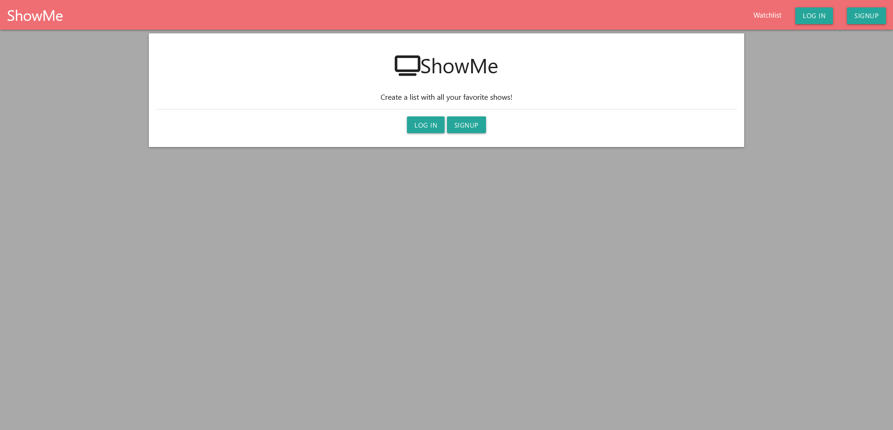
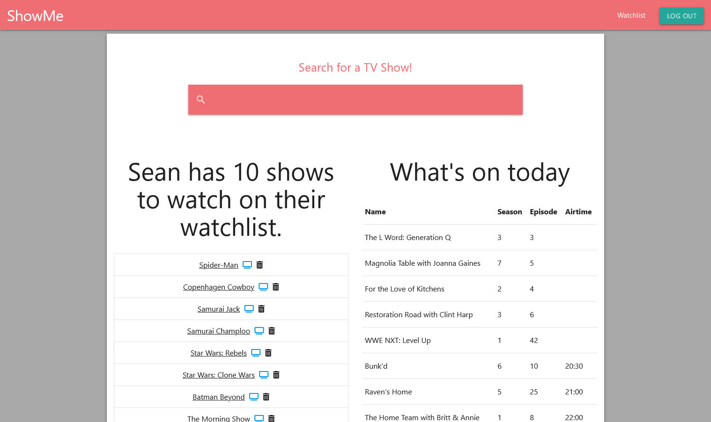

# ShowMe
A fullstack webapp built with a team using MVC Architecture, that calls an API to search a database of TV shows and returns the results to the user. We implemented  'authoraztion' so users can save shows to their personal watchlist and see what shows are on for the given date.

# Live Version
https://showme.onrender.com/

## How It's Made:

**Tech used:** HTML, CSS, JavaScript, NodeJS, Express, MongoDb

I used NodeJS and Express to pull results from the tvMaze API depending on the search parameters input by the user and displays each show with an img and list of genres. Users then have the option to add a show to their personal watchlist after making an account and logging in. The user can then go to a Dashboard and see their current watchlist and a list of shows on tv for the current date.

## Lessons Learned:

I learned how to connect and interact with a MongoDb database on the backend. Also how to pass parameters from the client side to the server side. We also built our teamwork skills and improved our use of github by creating issues and implementing a ticket system.

